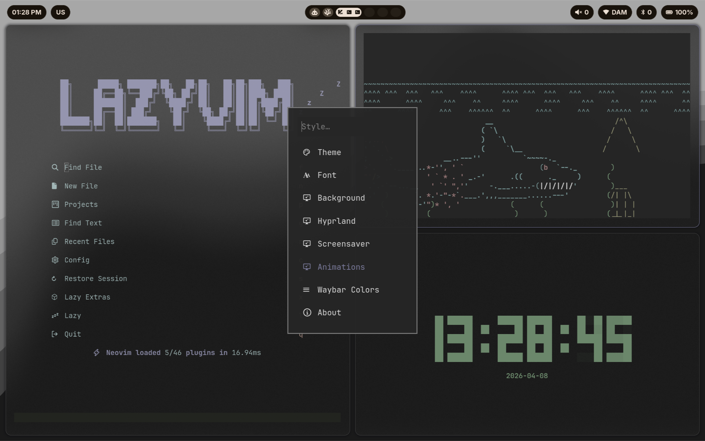

# dotfiles-omarchy

Personal dotfiles for [Omarchy](https://omarchy.org).

Heavily inspired by [atif-1402](https://github.com/atif-1402) and [saneaspect](https://www.youtube.com/@saneaspect).

## What's included

- **hypr** - Hyprland overrides: keybindings, autostart, look and feel, animations
- **waybar** - Custom status bar with clock, workspaces, audio, network, bluetooth, language and battery
- **omarchy** - Omarchy menu extensions: animation switcher, waybar color switcher in the STYLE menu

## Preview



## Installation

### 1. Back up existing configs

```sh
mv ~/.config/waybar/config.jsonc ~/.config/waybar/config.jsonc.bak
mv ~/.config/waybar/style.css ~/.config/waybar/style.css.bak
mv ~/.config/waybar/colors.css ~/.config/waybar/colors.css.bak
mv ~/.config/hypr/looknfeel.conf ~/.config/hypr/looknfeel.conf.bak
mv ~/.config/hypr/bindings.conf ~/.config/hypr/bindings.conf.bak
mv ~/.config/hypr/autostart.conf ~/.config/hypr/autostart.conf.bak
mv ~/.config/hypr/hypridle.conf ~/.config/hypr/hypridle.conf.bak
mv ~/.config/hypr/hyprland.conf ~/.config/hypr/hyprland.conf.bak
mv ~/.config/hypr/hyprlock.conf ~/.config/hypr/hyprlock.conf.bak
mv ~/.config/hypr/hyprsunset.conf ~/.config/hypr/hyprsunset.conf.bak
mv ~/.config/hypr/xdph.conf ~/.config/hypr/xdph.conf.bak
```

### 2. Clone the repository

```sh
git clone https://github.com/PavelBespakhotnyy/dotfiles-omarchy.git ~/dotfiles-omarchy
cd ~/dotfiles-omarchy
```

### 3. Stow the configs

[GNU Stow](https://www.gnu.org/software/stow/) must be installed

```sh
stow hypr waybar omarchy
```

### 4. Restart Waybar

```sh
omarchy-restart-waybar
```
Or use Omarchy's built in shortcut SUPER+SHIFT+SPACE
## Switching presets

Animations and waybar colors can be switched from the Omarchy menu:

```
Omarchy Menu -> Style -> Animations
Omarchy Menu -> Style -> Waybar Colors
```