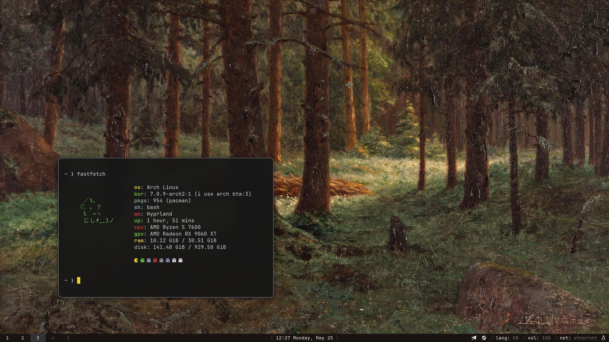
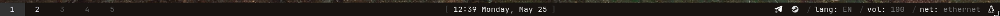

# dotfiles-omarchy

Personal dotfiles managed with GNU Stow.



## Waybar variants

**waybar-pills**


**waybar-pills**(black and white colors) (to make it black and white colors uncomment last lines in colors.css)


**waybar-slash**


**waybar-ulta-minimal**


## Structure

```
dotfiles-omarchy/
├── ghostty/.config/ghostty/
├── hypr/.config/hypr/
├── wallpapers/
├── waybar-bottom/.config/waybar/
├── waybar-pills/.config/waybar/
└── waybar-ulta-minimal/.config/waybar/
```

## Setup

Clone the repo:

```sh
git clone https://github.com/PavelBespakhotnyy/dotfiles-omarchy ~/dotfiles-omarchy
cd ~/dotfiles-omarchy
```

Remove existing configs:

```sh
# ghostty
rm -rf ~/.config/ghostty

# hypr (only tracked files)
rm -f ~/.config/hypr/autostart.conf
rm -f ~/.config/hypr/bindings.conf
rm -f ~/.config/hypr/hypridle.conf
rm -f ~/.config/hypr/hyprland.conf
rm -f ~/.config/hypr/hyprlock.conf
rm -f ~/.config/hypr/hyprsunset.conf
rm -f ~/.config/hypr/looknfeel.conf
rm -f ~/.config/hypr/xdph.conf

# waybar
rm -rf ~/.config/waybar
```

Stow packages (pick one waybar variant):

```sh
stow ghostty
stow hypr
stow wallpapers
stow waybar-pills        # or waybar-bottom / waybar-ulta-minimal
```
